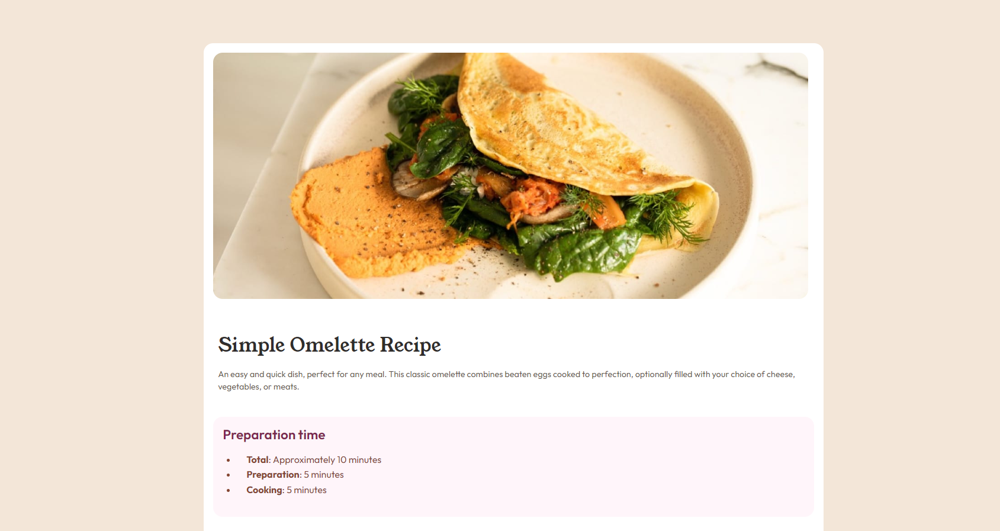

# Frontend Mentor - Recipe page solution

This is a solution to the [Recipe page challenge on Frontend Mentor](https://www.frontendmentor.io/challenges/recipe-page-KiTsR8QQKm). Frontend Mentor challenges help you improve your coding skills by building realistic projects. 

## Table of contents

- [Overview](#overview)
  - [The challenge](#the-challenge)
  - [Screenshot](#screenshot)
  - [Links](#links)
- [My process](#my-process)
  - [Built with](#built-with)
  - [What I learned](#what-i-learned)
  - [Continued development](#continued-development)
  - [Useful resources](#useful-resources)
- [Author](#author)

## Overview

A project of recipe website.

### Screenshot

### Links

- Solution URL: [Github](https://github.com/ViniCellist/Frontend-Mentor-Recipe-Page)
- Live Site URL: [Vercel](https://frontend-mentor-recipe-page-kappa.vercel.app/)

## My process

Started creating HTML structure and for style used CSS

### Built with

- Semantic HTML5 markup
- CSS3
- Flexbox

### What I learned

It was a good challenge do align table and ul content

### Continued development

One more step to become a fullstack dev

### Useful resources

- [HTML5](https://developer.mozilla.org/en-US/docs/Web) - Documentation.
- [CSS3](https://developer.mozilla.org/pt-BR/docs/Web/CSS) - Documentation.

## Author

- Github - [Portifolio](https://github.com/ViniCellist)
- Frontend Mentor - [Profile](https://www.frontendmentor.io/profile/ViniCellist)
- LinkedIn - [Professional](https://www.linkedin.com/in/vinicius-de-souza-duarte-57937b192/)
- Instagram - [Personal](https://www.instagram.com/vinicius_duartesd/)
